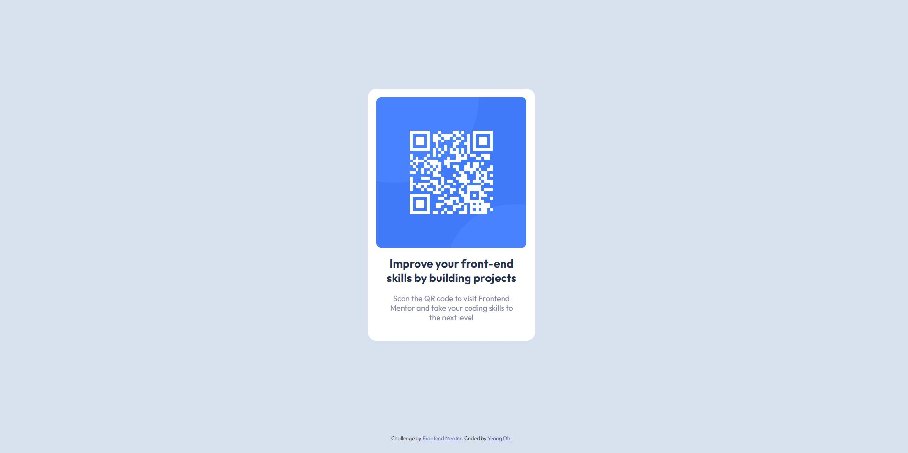

## Table of contents

- [Overview](#overview)
  - [Screenshot](#screenshot)
  - [Links](#links)
- [My process](#my-process)
  - [Built with](#built-with)
  - [What I learned](#what-i-learned)
- [Author](#author)
- [Acknowledgments](#acknowledgments)

## Overview

My first challenge at https://www.frontendmentor.io

### Screenshot



### Links

- Live Site URL: [Add live site URL here](https://your-live-site-url.com)

## My process

- created wrapper with full view height to center the card, and used column flex box to center contents inside the card.

### Built with

- Semantic HTML5 markup
- CSS

### What I learned

```HTML
Alt tag should not incldue hyphens and it should tell readers the purpose of the image. Do not include image, photo in alt tag.
If possible, </br> should not be used for line breaks as it can disrupt screen readers when reading the paragraph.
```

```css
The first project took me more than I expected. It helped me understand width and height of CSS more. Setting HTML font size 62.5% have compatibility issues with third-party libraries and possibly cause problems in the future.
```

## Author

- Frontend Mentor - [@YeongOh](https://www.frontendmentor.io/profile/YeongOh)
